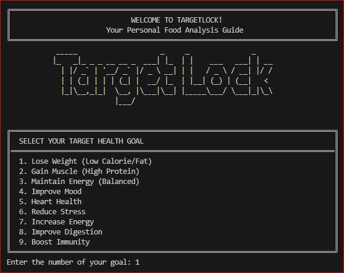
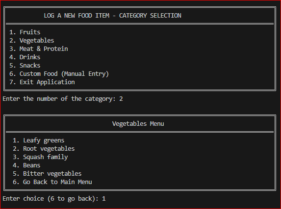
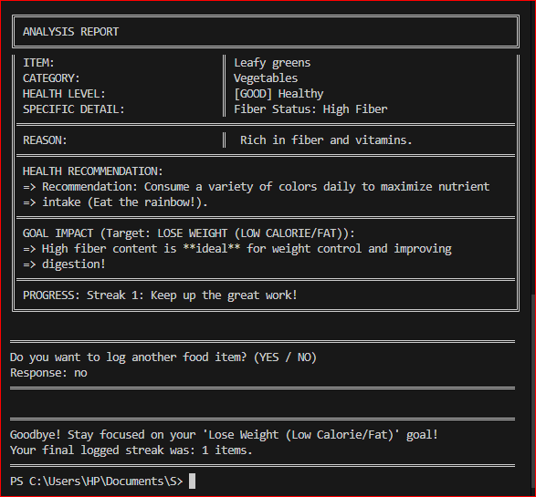
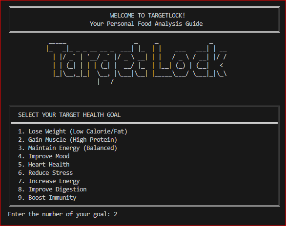
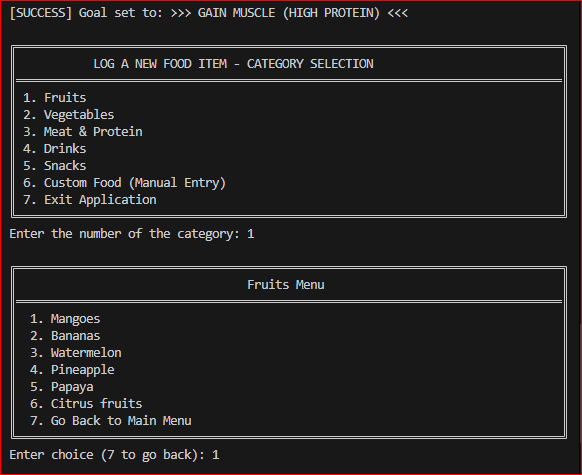
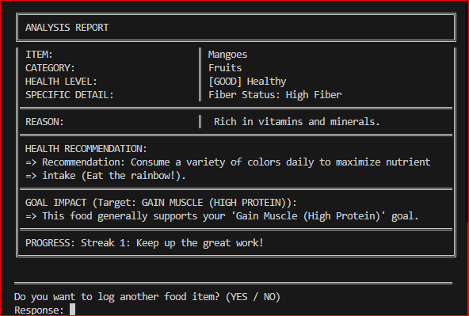
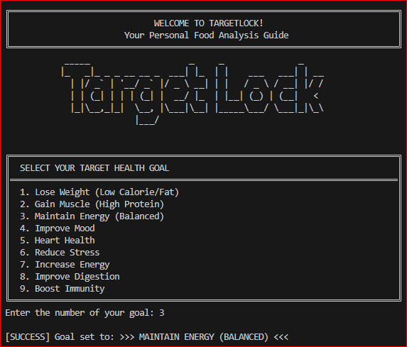
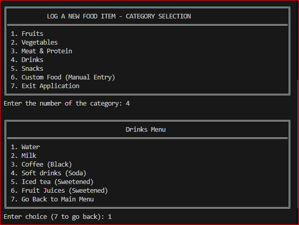
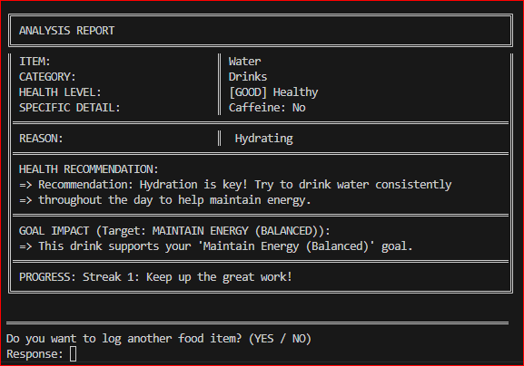

# **TARGET LOCK**

    
    
    
  

 

# TargetLock
**TargetLock** is designed to support a healthier lifestyle by empowering users to make more mindful and goal-aligned food decisions. Inspired by the principles of **`Sustainable Development Goal 3`**, the system promotes long-term wellness, disease prevention, and healthier daily habits through informed nutrition awareness. Whether your focus is overall fitness, improved mood, better sleep, glowing skin, stress reduction, or simply building a sustainable healthy routine, TargetLock encourages consistency and positive choices that contribute to your personal well-being.

---

## **DESCRIPTION/OVERVIEW**

TargetLock is designed to transform the process of healthy eating into a guided, data-driven experience. The system's core function is to connect a user's **target goal** directly with the nutritional impact of their food choices.

### **How it Works:**
1.  **Goal Selection:** The user first selects a specific health objective (**Muscle Gain, Weight Loss**, etc.).
2.  **Food Logging:** After choosing a food item (either from a pre-defined list or using the **Custom Food** option), TargetLock analyzes its **nutritional value, safety level**, and overall health impact.
3.  **Personalized Feedback:** The system then provides clear, personalized recommendations, informing the user whether the food **supports or goes against** their selected goal.
4.  **Motivation:** TargetLock includes a **streak tracker** that records each logged food, providing **encouraging messages** to motivate consistency and support long-term healthy habits, aligning with **SDG 3 – Good Health and Well-Being**.

---

## **OOP CONCEPTS APPLIED**

The application of **Object-Oriented Programming (OOP)** principles ensures a robust, maintainable, and scalable system structure.

| OOP Concept    | Description & Application in TargetLock                                                                                                                                                                                                                                                          |
|----------------|--------------------------------------------------------------------------------------------------------------------------------------------------------------------------------------------------------------------------------------------------------------------------------------------------|
| **Encapsulation** | Achieved by bundling data (food name, nutritional values, health goal) and the methods that operate on that data within classes like `FoodItem` and `UserProfile`. **Private** attributes protect internal data, ensuring it is only modified via controlled, **public** methods (getters/setters). |
| **Inheritance**  | Used to model specialized behaviors from a general type. A base class, **`HealthGoal`**, is extended by subclasses like **`WeightLossGoal`** or **`MuscleGainGoal`**. These subclasses share common properties but implement specific, distinct goal-checking logic. |
| **Abstraction**  | Focuses on showing essential features while hiding complex implementation details. The **`Analyzer`** class exposes a simple **`getRecommendation()`** method, abstracting away the complex nutritional calculations and safety checks performed internally. |
| **Polymorphism** | Allows a single interface to be used for different implementations. The core **`Analyzer`** interacts with all goal types through a single **`HealthGoal`** reference. When the **`analyze(food)`** method is called, the correct, goal-specific logic is executed. |

---

## **PROGRAM STRUCTURE** 

The system is designed with several key classes to manage functionality and data flow.

* **`TargetLockApp` (Main Class):** **Orchestrates** the main menu, user interaction, and overall program execution.
* **`UserProfile`:** **Stores** the user's chosen goal and manages the **streak tracker**.
* **`HealthGoal` (Abstract Base Class):** **Defines** the common interface for all health objectives.
    * *Subclasses:* `MuscleGainGoal`, `WeightLossGoal`, etc.
* **`FoodItem`:** **Represents** a piece of food with all nutritional attributes. Includes the **Custom Food** option.
* **`Analyzer`:** **Contains** the core logic for processing a food item against the user's goal, calculating the health impact, and generating **personalized recommendations**.
* **`StreakTracker`:** **Manages** the streak count and provides motivational messages for consistency.

---

## **HOW TO RUN THE PROGRAM**

This is a console-based application requiring a Java environment.

1.  **`Select Goal:`** First, the user selects their **desired health goal**.
2.  **`Select Food:`** After choosing a goal, the system displays food categories, and the user selects a specific item.
3.  **`Custom Food Option:`** If the food is not listed, they can use the **Custom Food** option, manually entering the food name and its nutritional values.
4.  **`Analysis and Recommendations:`** Once submitted, the system **analyzes** the input and informs the user about the food’s overall healthiness, its safety level, and personalized recommendations on whether it **supports or goes against** their selected goal. It also suggests **healthier options**.
5.  **`Motivation:`** The **streak tracker** is included to motivate consistency, encouraging users to regularly check their food choices and maintain a long-term healthy lifestyle.

---

## **SAMPLE OUTPUT**

  
Lose Weight

  
Gain Muscle

  
Maintain Energy

---

## **AUTHOR AND ACKNOWLEDGEMENT** 

**Gratitude to Our Instructor**

  

We would like to express our sincere gratitude to our CS 211 instructor, **`Ms. Christiana Grace Alib`**, for her invaluable mentorship and guidance. Her expertise in Object-Oriented Programming principles was crucial to our effective application of these concepts, leading to the successful development of our system, **TargetLock**.

---

### Project Made By: Looter's Members

<table>
  <tr>
    <td align="center">
      
       
      <b>Alea, Mariane M.</b>
       
      
       
      
       
    </td>
    <td align="center">
      
       
      <b>Baliwag, Justin Jake R.</b>
       
      
       
      
       
    </td>
    <td align="center">
      
       
      <b>Ibea, Daniel I.</b>
       
      
       
      
       
    </td>
    <td align="center">
      
       
      <b>Pabito, Sam Angelo A.</b>
       
      
       
      
       
    </td>
  </tr>
</table>
